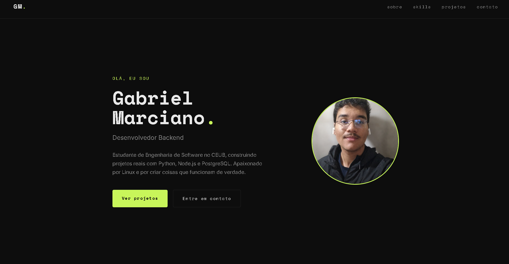

# Portfólio Pessoal — Gabriel Marciano

Portfólio pessoal desenvolvido para apresentar minhas habilidades, projetos e informações profissionais como desenvolvedor back-end.

O projeto foi construído com foco em design limpo, navegação simples e visual moderno, utilizando apenas HTML, CSS e JavaScript puro.

---

## Preview

---

## Tecnologias Utilizadas

- HTML5
- CSS3
- JavaScript
- Google Fonts
- Design Responsivo

---

## Funcionalidades

* Navegação suave entre seções
* Layout responsivo
* Sessão de apresentação profissional
* Cards de projetos
* Sessão de habilidades técnicas
* Área de contato com links externos
* Visual moderno inspirado em portfólios minimalistas

---

## Seções

### Hero

Apresentação inicial com nome, descrição profissional e botões de navegação.

### Sobre

Resumo profissional e informações acadêmicas.

### Skills

Tecnologias e ferramentas utilizadas no desenvolvimento back-end.

### Projetos

Exibição de projetos pessoais com descrição e links para o GitHub.

### Contato

Links rápidos para e-mail, GitHub e LinkedIn.

---

## Objetivo do Projeto

Este projeto foi desenvolvido para servir como portfólio profissional e centralizar meus principais projetos, tecnologias e informações para oportunidades de estágio e networking na área de desenvolvimento back-end.

---

## Contato

* LinkedIn: https://www.linkedin.com/in/gabriel-marciano-117183402/
* GitHub: https://github.com/GabrielMarcianoarante
* Email: [gabrielmarcianoarantedeassis@gmail.com](mailto:gabrielmarcianoarantedeassis@gmail.com)
